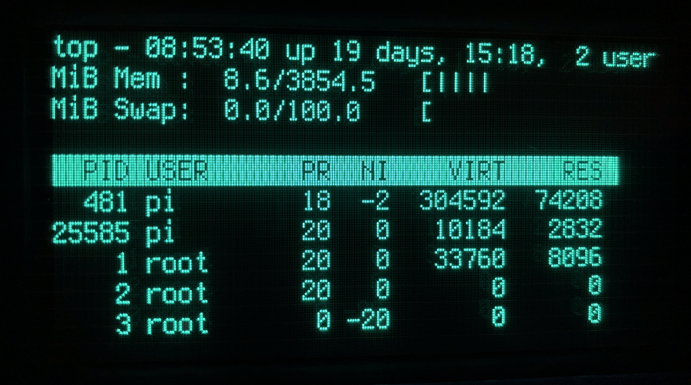

# Linux framebuffer driver for Noritake GU256x128*-D VFD display



Driver supports:
  - Display
  - Backlight
  - Touchscreen

Links:
-  [FBTFT source](https://github.com/raspberrypi/linux/tree/rpi-5.4.y/drivers/staging/fbtft)
-  [FBTFT wiki](https://github.com/notro/fbtft/wiki)
- Display module [product page](https://www.noritake-elec.com/products/model?part=GU256X128C-D903M)

<br><br><br><br>

## Setup environment

Get kernel source(change branch according to your current kernel version):
```bash
git clone --depth=1 --branch rpi-5.4.y https://github.com/raspberrypi/linux
```

Move FBTFT from staging to video:
```bash
mv ./linux/drivers/staging/fbtft ./linux/drivers/video
```

## Inject fbtft-gud into fbtft
Copy `fb_gud.c` to `linux/drivers/video/fbtft` folder.

Update `fbtft_device.c`, add this section to the `struct fbtft_device_display displays[]`:
```c
{
  .name = "gud",
  .spi = &(struct spi_board_info) {
    .modalias = "fb_gud",
    .max_speed_hz = 600000,
    .mode = SPI_MODE_3,
    .platform_data = &(struct fbtft_platform_data) {
      .display = {
        .buswidth = 8,
        .backlight = FBTFT_ONBOARD_BACKLIGHT,
      },
      .fps=60,
      .gpios = (const struct fbtft_gpio []) {
        { "reset", 17 },
        { "dc", 27 },
        {},
      },
    }
  }
}
```

Update `Kconfig`, add this section before the `config FB_TFT_FBTFT_DEVICE` entry:
```
config FB_TFT_GUD
	tristate "FB driver for the Noritake GU-D Display"
	depends on FB_TFT
	help
	  Framebuffer support for Noritake GU-D
```

Update `Makefile`, add this line to the end of the `#drivers` section:
```Makefile
obj-$(CONFIG_FB_TFT_GUD)     		 += fb_gud.o
```

## Build
```bash
make -j4 -C ~/linux SUBDIRS=drivers/video/fbtft modules
```

## Install
```bash
sudo insmod ~/linux/drivers/video/fbtft/fb_gud.ko
sudo insmod ~/linux/drivers/video/fbtft/fbtft_device.ko name=gud speed=600000 fps=60
```

## Display connection
Display should be connected using SPI interface. Check display datasheet for pinout reference and connect SPI pins to the according SPI pins on the RPI.
Aside from SPI pins, there is also RESET and BUSY pins, those can be connected to arbitrary GPIO pins on RPI and then configured in default device configuration section 
```c
.gpios = (const struct fbtft_gpio []) {
  { "reset", 17 },// RESET pin on the display connected to RPI GPIO17
  { "dc", 27 },   // BUSY pin on the display connected to RPI GPIO27
  {},
},
```
Or during module insertion into the kernel using `insmod` command arguments. 

## Link speed limitations
SPI speed should not exceed 600KHz, so if your raspberry configured for various CPU speed, it may exceed the limit set in driver configuration as it gets multiplied along with CPU clock multiplier.
So there is to options:
- set SPI speed below 600KHz, so when the system increases CPU clock multiplier, SPI speed does not exceed 600KHz - this option has downside of decreased FPS;
- lock CPU at fixed speed.

